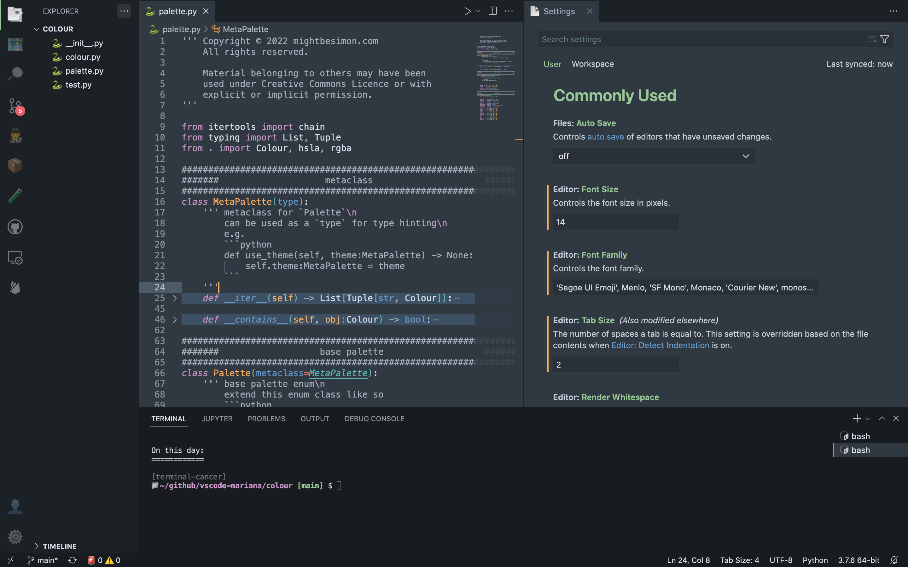

# Mariana 

> Most faithful port of Sublime Mariana theme!

Wanted a one to one copy of sublime, I already tried the bother ones :(

Wow this took way too long 😅



# Todo List

🚧 diff editor

🚧 merge conflict

🚧 panel 50% done

🚧 menu bar

🚧 command center

🚧 notification 50% done

🚧 banner

🚧 extension 50% done

🚧 keybinding labels

🚧 keyboard shortcut table

🚧 debug colours

🚧 testing colours

🚧 welcome page

🚧 breadcrums

🚧 snippets

🚧 symbol icons

🚧 debug icons

🚧 notebook

🚧 charts

🚧 ports

🚧 extension colours

✅ unit tests

✅ basically 80% of the work

> more ideas welcome 🙂
>
> PRs welcome 👨‍🍳👌💋

# Acknowledgements

- **Mariana Theme** - Dmitri Voronianski, Sublime HQ Pty Ltd

# Contributors

- **Simon** - [mightbesimon](https://github.com/mightbesimon)
- you?

# Colour Reference

```python
class Mariana(Palette):

	MARIANA  = hsla(210, 15, 22)
	DARK_0   = MARIANA.clone(l=11)
	DARK_1   = MARIANA.clone(l=13)
	DARK_2   = MARIANA.clone(l=19)
	MEDIUM_0 = MARIANA.clone()
	MEDIUM_1 = MARIANA.clone(l=40, a=75)
	MEDIUM_2 = MARIANA.clone(l=45)
	LIGHT_0  = hsla(220, 12, 69)
	LIGHT_1  = hsla(220, 28, 88)
	RED_0    = hsla(357, 79, 65)
	RED_1    = hsla( 13, 93, 66)
	ORANGE   = hsla( 32, 93, 66)
	YELLOW   = hsla( 40, 94, 68)
	MINT     = hsla(114, 31, 68)
	TEAL     = hsla(180, 36, 54)
	BLUE     = hsla(210, 50, 60)
	PURPLE   = hsla(300, 30, 68)
```
